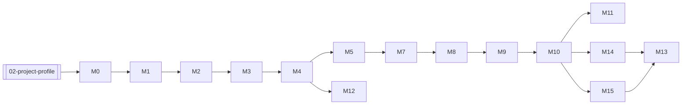

# Граф зависимостей

> Профиль: [[02-project-profile]] · Агент: [[AGENT]]

## Цепочка этап 1 (starter 2×4 m)

## Документы

| Файл | ID | Зависит от | Блокирует | Синхронизировать |
|------|----|------------|-----------|------------------|
| [[02-project-profile]] | profile | — | все | overview, graph, M0, M15, AGENT |
| [[00-overview]] | overview | profile | M* | profile, graph |
| [[milestones/M0-pre-construction]] | M0 | profile | M1 | profile, M14, M15 |
| [[milestones/M1-pile-strapping-floor-box]] | M1 | M0 | M2 | profile, M15 |
| [[milestones/M2-floor-system]] | M2 | M1 | M3 | profile, M3, M9 |
| [[milestones/M3-wall-framing]] | M3 | M2 | M4 | profile, M12 |
| [[milestones/M4-wall-raising-top-plate]] | M4 | M3 | M5, M12 | profile |
| [[milestones/M5-wall-sheathing-bridging]] | M5 | M4 | M7 | profile, M11 |
| [[milestones/M7-rafter-system]] | M7 | M5 | M8 | profile, M10, M15 |
| [[milestones/M8-eaves-fascia-roof-underlay]] | M8 | M7 | M9 | M2 |
| [[milestones/M9-roof-insulation-batten]] | M9 | M8 | M10 | M12 |
| [[milestones/M10-roofing-ridge]] | M10 | M9 | M11, M14, M15 | profile, M15 |
| [[milestones/M11-wind-wrap-facade-prep]] | M11 | M10 | M13 | M5 |
| [[milestones/M12-internal-partitions]] | M12 | M4 | M13 | profile, M14 |
| [[milestones/M14-mep-finishes]] | M14 | M10 | M13 | profile, M0 |
| [[milestones/M13-drywall-plancken]] | M13 | M11, M14 | — | M15 |
| [[milestones/M15-phase2-l-extension]] | M15 | M10, profile | M13 | profile, M1, M7, M10 |

## Концепты

| ID | Канон | Где | Суть |
|----|-------|-----|------|
| `nl-coastal-recreatiepark` | [[02-project-profile]] | profile, M0 | NL побережье, парк, 50 m² |
| `starter-2x4m` | [[02-project-profile]] | M1–M5, M14 | 2×4 m = 8 m² |
| `final-l-50sqm` | [[02-project-profile]] | M15 | L до 50 m² |
| `framing-45x95` | [[02-project-profile]] | M3, M5, M15 | 45×95 mm C24 |
| `roof-monopitch-phase1` | [[02-project-profile]] | M7, M10, M15 | Односкат над 2×4 |
| `piles-starter-only` | [[02-project-profile]] | M1, M15 | Сваи под starter; ножка L — этап 2 |
| `winter-passive-vent` | [[02-project-profile]] | M5, M10, M15 | Вентиляция пустого дома зимой |
| `phase1-deadline-2026` | [[02-project-profile]] | M0 | Сезон 2026 |
| `spacing-minus-10mm` | [[milestones/M2-floor-system]] | M2, M3, M9 | Шаг = ширина утеплителя − 10 mm |
| `diagonal-check` | [[milestones/M1-pile-strapping-floor-box]] | M1 | Диагонали ±5 mm |
| `insulation-no-bulge` | [[milestones/M2-floor-system]] | M2, M9 | Утеплитель без бугра |
| `plywood-18mm` | [[milestones/M2-floor-system]] | M2 | Фанера 18 mm |
| `osb-18mm` | [[milestones/M5-wall-sheathing-bridging]] | M5, M11 | OSB-3 18 mm |
| `screws-then-nails` | [[milestones/M3-wall-framing]] | M3, M4, M5 | Шурупы → гвозди |
| `vapor-barrier` | [[milestones/M2-floor-system]] | M2, M8, M9 | Пароизоляция |
| `wind-membrane` | [[milestones/M11-wind-wrap-facade-prep]] | M1, M11 | WRB побережье |
| `mep-before-gkl` | [[milestones/M14-mep-finishes]] | M13, M14 | Инженерка до GKL |
| `solo-crew-min` | [[02-project-profile]] | M4 | Помощники на подъём |
